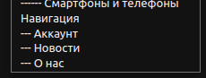

# Документация
## Запуск проекта и работа с ним
### Клонирование проекта
1) Клонируйте к себе в рабочую папку проект
> git clone https://github.com/YaroslavIonin/menu_project.git

2) Перейдите в папку проекта
> cd menu_project

### Запуск проекта 
1) Выполните команду:
> sudo docker-compose up --build -d

***Проект запущен !!!***

### Создание админа
1) Выполните команду:
> sudo docker-compose exec project python3 manage.py createsuperuser

2) Придумайте имя, почту и пароль админа и запомните их.

***Админ создан***

## Работа с приложением
### Создание меню
1) Перейдите на [сайт](http://0.0.0.0:8000/)

Вы попали на начальную страницу сайта с меню. Меню пока у нас нет.

2) Перейдите в [административную панель](http://0.0.0.0:8000/admin/)
3) Войдите за админом, которого создали ранее.
4) На странице видите модель Меню.

5) Создайте новое меню.

6) Создайте Элемент меню.

Это будет корневой элемент меню

7) Создайте дочерние элементы

8) Таким же образом создайте нужное древовидное меню

***Меню создано***

### Добавление меню на страницу html
1) Остановите приложение:
> sudo docker-compose stop
2) Удобным для вас способом откройте файл project/templates/base.html в текстовом редакторе
3) Раскомментируйте строчку для отрисовки меню. В кавычках пишется название, которое вы написали при создании меню

4) Сохраните изменения и перезапустите проект
> sudo docker-compose up --build -d

5) Перейдите на [сайт](http://0.0.0.0:8000/)
6) На сайте появилось созданное древовидное меню

### Добавление новых меню
1) Аналогичным способом можно добавить новое меню(menu_2) и его элементы

2) Раскомментировав строчку в base.html, на главной странице сайта увидим ещё одно меню

Таким образом, можно отрисовывать нужное меню на любой странице сайта
